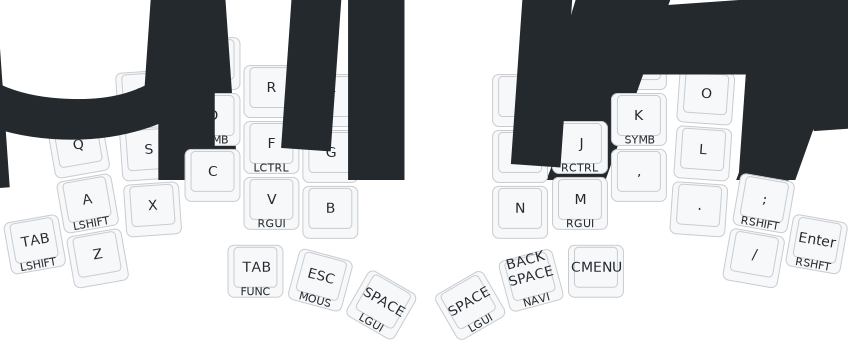
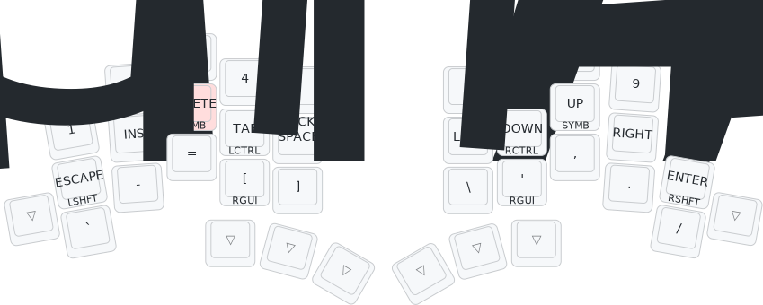

# Muscle memory friendly Home Row Mods for the TOTEM keyboard

This repository contains the implementation of a keyboard layout suitable for
40% keyboards, based on “home row mods”. The layout is designed for software
developers and authors of multilingual texts. Particular emphasis was placed on
ease of learning. The layout presented here is implemented both as a Kanata
driver for standard keyboards on Linux, Mac, and Windows computers,
and as ZMK Firmware for the small 38 key column-staggered split 
[TOTEM keyboard]. This way you benefit from ergonomic home row mods on all
your input devices.

Read the accompanying blog post here:
[Jens Getreu's blog - Muscle memory friendly home row mods](https://blog.getreu.net/20250826-muscle-memory-friendly-home-row-mods/)

[ZMK Firmware]: https://zmk.dev/
[Kanata]: https://github.com/jtroo/kanata
[zmk-config-totem/kanata/qwerty-home-row-mods.kbd]: https://github.com/getreu/zmk-config-totem/blob/master/kanata/qwerty-home-row-mods.kbd
[getreu/zmk-config-totem]: https://github.com/getreu/zmk-config-totem
[TOTEM keyboard]: https://github.com/GEIGEIGEIST/TOTEM

## HOW TO USE

- fork this repo
- `git clone` your repo, to create a local copy on your PC (you can use the [command line](https://www.atlassian.com/git/tutorials) or [github desktop](https://desktop.github.com/))
- adjust the totem.keymap file (find all the keycodes on [the zmk docs pages](https://zmk.dev/docs/codes/))
- `git push` your repo to your fork
- on the GitHub page of your fork navigate to "Actions"
- scroll down and unzip the `firmware.zip` archive that contains the latest firmware
- connect the left half of the TOTEM to your PC, press reset twice
- the keyboard should now appear as a mass storage device
- drag'n'drop the `totem_left-seeeduino_xiao_ble-zmk.uf2` file from the archive onto the storage device
- repeat this process with the right half and the `totem_right-seeeduino_xiao_ble-zmk.uf2` file.

